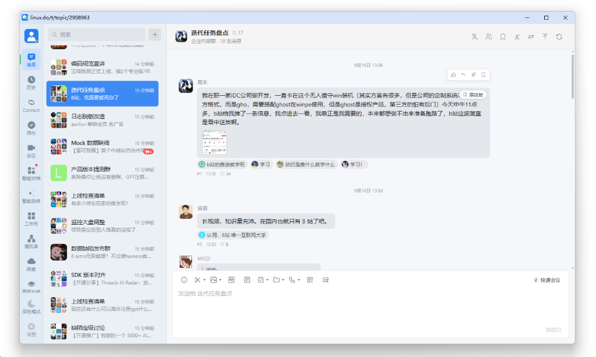

# Linux.do & V2EX 企业微信主题

把 [Linux DO](https://linux.do/) 与 [V2EX](https://v2ex.com/) 深度定制为**企业微信 5.x 桌面端**现代 IM 风格。在保留原站真实数据、动态路由、通知系统、交互逻辑与账号功能的同时，提供极致优雅、沉浸且逼真的“办公”摸鱼体验。

- 作者：**Richy**
- 当前版本：**0.7.61**
- 用户脚本：[`linuxdo-wecom.user.js`](linuxdo-wecom.user.js)
- 脚本元数据：[`linuxdo-wecom.meta.js`](linuxdo-wecom.meta.js)
- 许可证：MIT

---

## 效果预览

### 主界面全景预览
全新企业微信 5.x 现代布局，完整重构左侧主导航栏、会话列表栏、右侧聊天窗口与沉浸式底部输入框：



---

### 精选功能演示

| 帖子详情与会话流 | 沉浸式回复框 |
| :---: | :---: |
|  |  |

| 自定义聊天背景水印 | 原生视图快速切换 (Alt+W / Alt+O) |
| :---: | :---: |
|  |  |

| 点击展开分类与节点导航 | 消息通知与悬浮卡片 |
| :---: | :---: |
|  |  |

> 注：以上演示均由公开话题生成，绝不涉及私密敏感数据。

---

## 核心特性

### 1. 经典企业微信 5.x 桌面端像素级还原
- **三栏式标准布局**：深色/浅色左侧图标导航栏（162px/窄栏）、中间会话列表栏（304px，支持可拖拽调整宽度）与右侧消息详情/输入栏。
- **消息气泡与头像**：本人消息浅蓝气泡居右、他人消息白灰气泡居左；支持一键开启**伪装头像模式**（自动转换为单字头像或九宫格群头像），防窥更安全。
- **相对时间动态刷新**：会话列表与聊天气泡的时间标签（“刚刚”、“5分钟前”）后台实时自动更新，无需手动刷新网页。
- **深浅色无缝适配**：支持浅色模式、深色模式与跟随系统自动切换，黑暗环境下舒适护眼。

### 2. Linux.do 平台深度集成与优化
- **Connect 数据面板**：左侧栏原“日程”按键深度打造成 **Connect** 快捷入口，点击即可打开专有弹窗，实时读取并呈现 `connect.linux.do` 的信任等级（Trust Level）、要求环形进度盘、指标条形图、每日额度与投票/违规状态。
- **即时点赞与微动效**：接入 Discourse Reactions 官方插件接口（`custom-reactions/heart/toggle`），点赞瞬间触发弹性 `scale(1.15)` 动效与爱心计数徽标乐观增减，并附带轻量 Toast 提示；精准拦截给自己的帖子点赞。
- **楼层精准回复与定位**：支持指定楼层快速回复，引用消息展示原作者与内容摘要，点击直接平滑滚动定位到对应楼层。
- **话题书签与原版资料卡**：点击用户头像直接呼出原版完整个人资料卡；标题栏支持原版话题书签收藏、命名与取消。
- **无痕回复与表情包**：输入框按 `Enter` 发送、`Shift + Enter` 换行；支持 Discourse 官方表情面板，支持直接粘贴或拖拽图片并自动上传。

### 3. V2EX 平台深度集成与体验增强
- **对话楼层关系（树状会话层级视图）**：支持在左下角设置中一键开启/关闭“对话楼层关系”（快捷键 `Alt+T`）；严格依据回帖开头的 `@author` 与 `#floor` 建立时序分支树，采用优雅连贯的左侧连续导引线与 `:has()` 聚焦高亮（参考 GreasyFork 590698 经典设计），无引用独立回帖平铺展示不杂乱，点击回复角标直接平滑滚动定位并高亮父楼层。
- **无感后台轮询与滚动锁定**：浏览帖子详情时，后台静默定时轮询新回复并自动追加到对话流中；独家采用 `overflow-anchor: none` 与视口锁定算法，**阅读中滚动条位置绝对不会发生跳动或偏移**。
- **个人中心与自动签到**：点击左上角个人头像直接呼出个人信息浮层，清晰展示金币、银币、铜币余额胶囊；支持一键自动领取每日登录签到奖励，并伴随礼花 Toast 提示。
- **成员名片卡与快捷操作**：点击任意成员头像快速弹出名片卡，支持一键**特别关注**、**屏蔽用户**以及查阅该用户在全站的最新回复列表；准确显示 OP 楼主身份；**智能识别 404 封号或改名状态**，清晰标注“已封号 / 改名”警示与原因说明。
- **二级分类导航**：左侧支持展开 V2EX 分类标签栏与全部节点树，并在本地对节点进行高效持久化缓存。
- **Imgur 图床上传**：在 V2EX 下发帖或回复时，点击图片按钮、粘贴剪贴板截图或拖拽图片，自动通过 Imgur API 完成图床托管并将直链插入编辑框。

### 4. 摸鱼神器与效率小工具
- **快捷键瞬间穿梭**：按下 **`Alt + W`** 或 **`Alt + O`** 即可在企业微信 IM 视图与原站原版网页之间毫秒级无痕切换。
- **划词 Base64 快速解码**：页面中划选任意 Base64 字符串时，自动浮现解码卡片（支持 UTF-8 中文、URL-safe Base64、无 padding、常见前后缀），提供一键复制与快捷打开链接/磁力链。
- **输入框 Base64 编码插入**：编辑工具栏集成 Base64 转换工具，快速将文本转换为密文插入回复中。
- **自定义背景水印**：支持自定义聊天窗口背景水印文字与开关，所有设置仅保存在本地浏览器中。
- **图片多档平滑缩放**：聊天流中的图片点击即可打开全屏灯箱，支持 25%～500% 鼠标滚轮平滑缩放与拖拽查看。
- **避让机制**：自动检测 IDEA、飞书、钉钉等其他主题脚本并礼貌避让，同一时间只激活一套外观。

---

## 快速安装

1. 首先安装浏览器脚本管理器：
   - 推荐使用 [Tampermonkey (篡改猴)](https://www.tampermonkey.net/) 或 [Violentmonkey (暴力猴)](https://violentmonkey.github.io/)。
2. 点击下方链接一键安装用户脚本：
   - **[安装用户脚本 (Raw)](https://github.com/samsamsue/wecom_v2linuxdo/raw/main/linuxdo-wecom.user.js)**
3. 脚本管理器将自动弹出安装界面，点击“安装”或“更新”即可。
4. 安装完成后，打开 [Linux DO](https://linux.do/) 或 [V2EX](https://v2ex.com/) 即可自动呈现企业微信界面。

```text
脚本安装直链：
https://github.com/samsamsue/wecom_v2linuxdo/raw/main/linuxdo-wecom.user.js
```

---

## 自动更新机制

脚本提供双重自动更新保障：
- **脚本管理器自动更新**：配置有轻量级的 `@updateURL` ([`linuxdo-wecom.meta.js`](linuxdo-wecom.meta.js))，管理器会在后台定期静默比对版本并更新。
- **内置新版静默探测**：进入页面 5 秒后在后台比对版本，发现新版时将在界面右下角优雅弹出提醒，可点击**立即更新**一键跳转管理器确认。

---

## 操作与快捷键速查表

| 按键 / 操作区域 | 功能说明 |
| :--- | :--- |
| **`Alt + W`** / **`Alt + O`** | 随时切换企业微信主题与原站原生网页视图 |
| **左侧个人头像** | 打开通知中心、个人设置与快捷菜单（支持查看 V2EX 金币与签到） |
| **左侧 Connect 图标** | （Linux DO）打开 Connect 实时信任等级与数据看板 |
| **会话列表顶部“+”** | 展开或收起板块、分类与节点树 |
| **会话列表顶部搜索框** | 实时搜索原站帖子与话题 |
| **伪装头像切换按钮** | 切换真实头像 / 单字头像 / 九宫格头像伪装 |
| **消息气泡悬浮工具栏** | 点赞、回复、楼层书签收藏、编辑本人消息 |
| **被回复楼层引用框** | 显示被引用消息摘要，点击直接跳转至该楼层 |
| **聊天标题栏书签** | 打开原版话题书签弹窗，支持收藏与提醒设置 |
| **聊天标题栏水印** | 打开聊天背景水印设置，可自定义文字 |
| **聊天标题栏原生外链** | 快速切回原生网页视图（右下角常驻切回企微按钮） |
| **底部输入区** | `Enter` 发送消息，`Shift + Enter` 换行；支持粘贴/拖拽截图 |
| **输入区表情与图片按钮** | 呼出官方表情面板或本地文件选择器上传图片 |
| **聊天图片点击** | 开启图片大图灯箱预览，支持滚轮 25%~500% 无级缩放 |

---

## Chrome PWA 无边框客户端模式（终极摸鱼）

配合 Chrome / Edge 浏览器的“将此站点作为应用安装”（PWA）功能，本仓库内附专属 Win32 无边框极简小工具，让网页窗口摇身一变成为真正的原生企业微信客户端窗口！

- **一键启动**：双击运行根目录下的 `一键启动无边框.bat`。
- **常用快捷键**：
  - **`F8`**（或 `Alt + F11`）：一键显示 / 隐藏窗口标题栏与边框。
  - **`Alt + 鼠标左键拖动`**：按住 `Alt` 键在窗口任意位置拖动，即可随心所欲移动窗口。
- **一键退出**：双击运行 `退出无边框工具.bat`，即可恢复原生窗口标题栏并退出后台工具。

---

## 开发者与发布规范

本地代码修改后，可通过根目录脚本快速同步版本与测试：

```powershell
# 升级版本并自动同步元数据与 README（如升级至 0.7.41）
python scripts/release.py 0.7.41

# 校验所有元数据文件是否严格同步
python scripts/release.py --check

# 执行全量单元测试套件（95+ 项测试）
node --test tests/*.test.cjs
```

---

## 项目结构

```text
linuxdo-wecom-ui/
├─ linuxdo-wecom.user.js       # 核心用户脚本（涵盖企微全套视图、交互与 API 桥接）
├─ linuxdo-wecom.meta.js       # 轻量级元数据检查文件（用于脚本管理器自动更新）
├─ scripts/
│  └─ release.py              # 版本自动化发布与元数据校验同步脚本
├─ snapshot/
│  ├─ linuxdo-wecom-preview.png # 主界面高清全景截图
│  ├─ 帖子详情.png
│  ├─ 回复框.png
│  ├─ 自定义聊天背景水印.png
│  ├─ 点击展开分类列表.png
│  ├─ 刷新网页.png
│  ├─ 切换原生视图.png
│  └─ hover头像通知.png
├─ tests/                     # 自动化测试用例集合
├─ 一键启动无边框.bat           # PWA 无边框启动脚本
├─ 退出无边框工具.bat           # 恢复边框退出脚本
├─ README.md                  # 项目中文说明文档
└─ LICENSE                    # MIT 开源许可证
```

---

## 声明

本项目仅对 Linux.do 与 V2EX 进行前端样式定制与交互增强，不提供企业微信服务，亦不隶属于或代表腾讯公司、企业微信、Linux.do 或 V2EX 官方。所有数据交互均直接发生于用户本地浏览器与对应社区站点之间。

## License

MIT License © 2026 Richy
